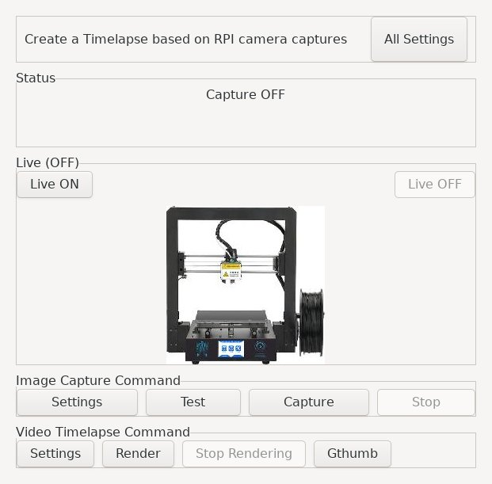
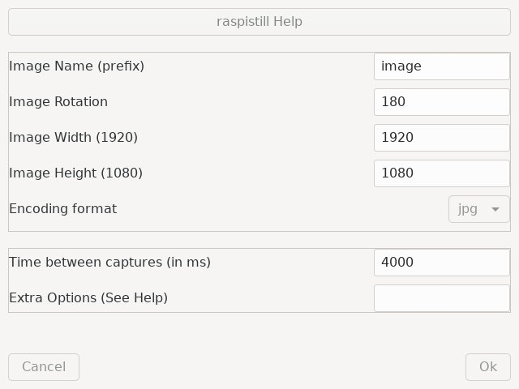

# py3gtk_rpi_camera

I am now doing some 3D printing, and there is no real **simple GUI** to be able to
**capture images** and **create** a **timelapse video** from an RPI camera, except doing everything
by command line, or using an external interface like octopi.
Goal of this simple tool is to offer a GUI to manage this task by just clicking
on button :)

Why an RPI camera?

You can find easily RPI camera for ~12€ today, so this is quite interesting to using it on an RPI board.

DEVEL VERSION, so there is probably som bugs :)

# config.ini

Default configuration file. You can change parameter using the GUI.

# Python requires

* PIL 
* configparser
* subprocess
* sys
* io
* time
* datetime
* threading
* os.path
* Gtk, Gio, GLib, GObject, Gst, GstVideo

# Requires

* **ffmpeg**: to create the video (output.mp4)
* **raspistill** : to capture the image from the RPI camera
* **gthumb**: optional for images triage

# Usage

Just clone this repo, and launch it:
```
$ python3 py3gtk_rpi_camera.py
```

# Rendering

The tool use **ffmpeg** to render the video. On a RPI this can take some time...
The video **output.mp4** is store in the working dir.

* You can double speed the video with stepts filter, but this will drop frame:
```
ffmpeg -i YOURVIDEO.mp4 -setpts 0.5*PTS output.mp4
```

# Know issues

* When you click **Live On** the live streaming could not be displayed, if so just resize a bit the Main window and you will see it. I don't know yet how to fix this issue...
* killing grabing the subprocess pid cause some errors, so using a killall instead... not really clean
* setting didn't retrieve image encoding type
* RPI camera can cause some calltrace : [81515.260266] Hardware name: BCM2711 [81515.260418] PC is at port_disable+0xa0/0x118 [bcm2835_mmal_vchiq]


# TODO

There is probably plenty of other features that this tool can have :)

* redo a video encoding with **stepts** option
* propose value for ffmpeg rendering based on the number of images
* being able to increase/decrease the Live frame size
* being able to change the name of the video
* add more options in the video rendering setting
* split the code in multiple files

# Images






