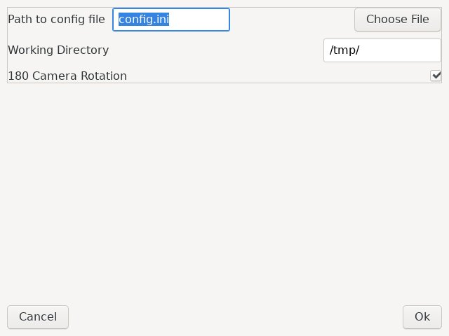
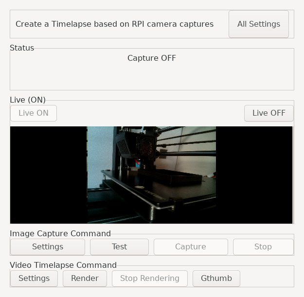

# py3gtk_rpi_camera

I am now doing some 3D printing, and there is no real **simple GUI** to be able to
**capture images** and **create** a **timelapse video** from an RPI camera, except doing everything
by command line, or using an external interface like octopi.
Goal of this simple tool is to offer a GUI to manage this task by just clicking
on button :)

Why an RPI camera?

You can find easily RPI camera for ~12€ today, so this is quite interesting to using it on an RPI board.

DEVEL VERSION, so there is probably som bugs :)

# config.ini

Default configuration file. You can change parameter using the GUI.

# Python requires

* PIL 
* configparser
* subprocess
* sys
* io
* time
* threading
* os.path
* Gtk, Gio, GLib, GObject, Gst, GstVideo

# Requires

* **ffmpeg**: to create the video (output.mp4)
* **raspistill** : to capture the image from the RPI camera
* **gthumb**: optional for images triage

# Usage

Just clone this repo, and launch it:
```
$ python3 py3gtk_rpi_camera.py
```

# Know issues

When you click **Live On** the live streaming could not be displayed,
if so just resize a bit the Main window and you will see it.
I don't know yet how to fix this issue...

# The Futur?

There is probably plenty of other features that this tool can have :)

# Images






